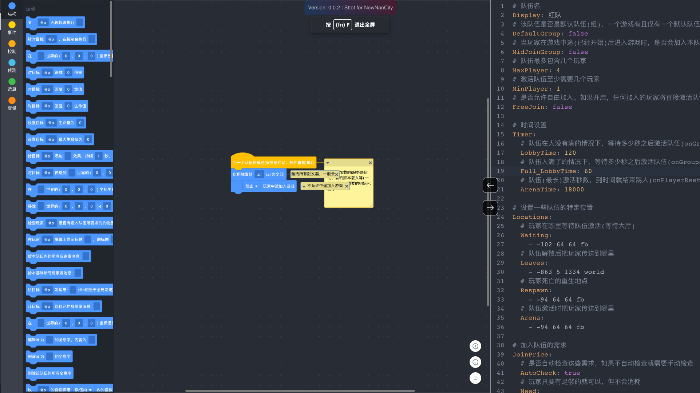

# CsgScratch Editor

[View Document](https://www.wolai.com/newnan/cPurm6edhJ5sv1JDRoYyd5)

<center>

[](https://github.com/NewNanCity/CsgScratch)&nbsp;&nbsp;[](https://github.com/NewNanCity/CsgScratch)&nbsp;&nbsp;[](https://github.com/NewNanCity/CsgScratch)

[](https://github.com/NewNanCity/CsgScratch)&nbsp;&nbsp;[](https://github.com/NewNanCity/CsgScratch)&nbsp;&nbsp;[](https://github.com/Gk0Wk)

</center>center



## Setup

Install the dependencies:

```bash
pnpm install
```

## Get Started

Start the dev server:

```
pnpm dev
```

Build the app for production:

```
pnpm build
```

For more information, see the [Modern.js documentation](https://modernjs.dev/en).
